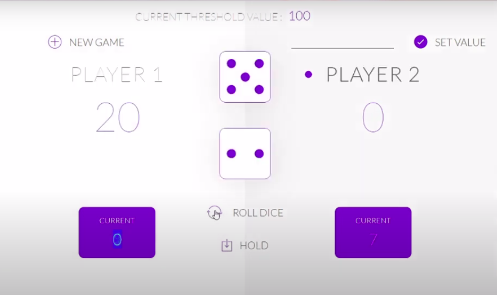

# pig-game

A Casino type game where you have to roll the dice and you will get a random number. You have to Roll until you Hold it, as soon as you Hold the Total current score will be added to your actual score. The one who Acheive the Target score first will WIN THE GAME!!!. So Enjoy {:)} 

## Color pallet to be followed:
 Stick to the color pallet as much as possible.
1. #CDC7B2 
2. #972B4E 
3. #15132F 

## For reference see the image:
 
